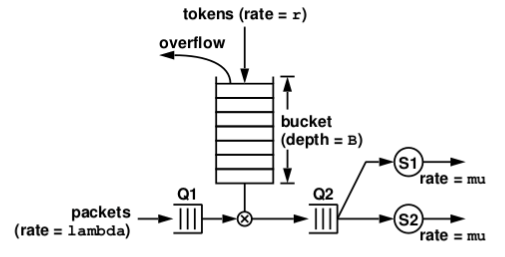

# Multithreading_Token_Bucket_Simulation
 
**Synopsis**:
In this project, I designed a traffic shaper to transmit/service packets controlled by a token bucket filter using multi-threading within a single process. I implemented five different threads working together to efficiently transmit packet objects in a time-driven fashion; when the program runs, it produces a simulation trace (printed timestamps) for every important event. I engineered the program to account for versatility such as processing input files and modifying settings using user-specified parameters.

Here is a system with a token bucket filter:

The token bucket has a capacity (bucket depth) of B tokens. Tokens arrive into the token bucket according to an unusual arrival process where the inter-token-arrival time between two consecutive tokens is 1/r. Call r the token arrival rate (it's not exactly the token arrival rate; understand that this is different from saying that the tokens arrive at a constant rate of r). Extra tokens (overflow) would simply disappear if the token bucket is full. A token bucket, together with its control mechanism, is referred to as a token bucket filter. Packets arrive at the token bucket filter according to an unusual arrival process where the inter-arrival time between two consecutive packets is 1/lambda. Call lambda the packet arrival rate (it's not exactly the packet arrival rate; understand that this is different from saying that the packets arrive at a constant rate of lambda). Each packet requires P tokens in order for it to be eligible for transmission. (Packets that are eligiable for transmission are queued at the Q2 facility.) When a packet arrives, if Q1 is not empty, it will just get queued onto the Q1 facility. Otherwise, it will check if the token bucket has P or more tokens in it. If the token bucket has P or more tokens in it, P tokens will be removed from the token bucket and the packet will join the Q2 facility (first add the packet to Q1 and timestamp the packet, remove the P tokens from the token bucket and the packet from Q1 and timestamp the packet, before moving the packet into Q2), and wake up the servers in case they are sleeping. If the token bucket does not have enough tokens, the packet gets queued into the Q1 facility. Finally, if the number of tokens required by a packet is larger than the bucket depth, the packet must be dropped (otherwise, it will block all other packets that follow it). 

The transmission facility (denoted as S1 and S2 in the above figure, referred to as the "servers") serves packets in Q2 in the first-come-first-served order and at a transmission/service rate of mu per second. When a server becomes available, it will dequeue the first packet from Q2 and start transmitting/servicing the packet. When a packet has received 1/mu seconds of service, it leaves the system. The servers will be kept as busy as possible.

When a token arrives at the token bucket, it will add a token into the token bucket. If the bucket is already full, the token will be lost. It will then check to see if Q1 is empty. If Q1 is not empty, it will see if there is enough tokens to make the packet at the head of Q1 be eligible for transmission (packets in Q1 are also served in the first-come-first-served order). If it does, it will remove the corresponding number of tokens from the token bucket, remove that packet from Q1 and move it into Q2, and wake up the servers in case they are sleeping. It will then check the packet that is now at the head of Q1 to see if it's also eligible for transmission, and so on.

- To compile the program, use the command: make warmup2
- To run the program, use the command: ./warmup 2 [-lambda lambda] [-mu mu] [-r r] [-B B] [-P P] [-n num] [-t tsfile]. 

**NOTE**: The square bracketed items are optional, and they represent the following:
- lambda = arrival rate (1/lambda is inter-arrival time)
- mu = service rate (1/mu is transmission/service time (number of seconds of service time))
- r = token rate (1/r inter-token arrival time)
- B = number of tokens allowed in bucket
- P = token requirement for a particular packet
- n = total number of packet to be read in
- tsfile = name of tfile

An example output can be seen in f2.out file (more details outlined in f2.ana) when running ./warmup2 -B 1 -t f2.txt.

Another example is running the following: ./warmup2 -t tsfile.txt.